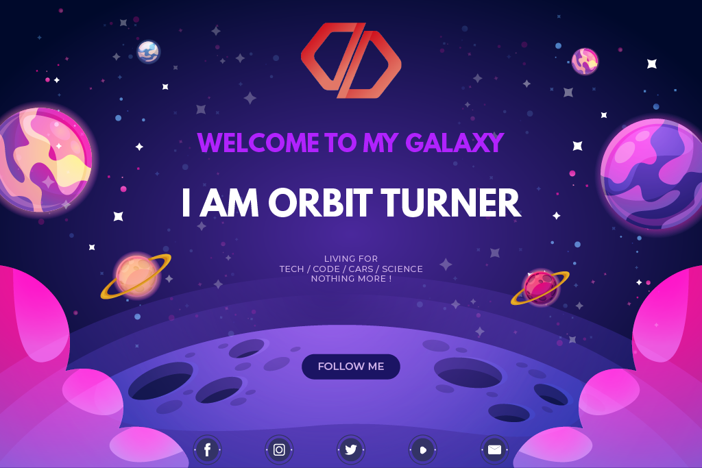

________
<p align="center">
  <a href="http://orbitturner.yj.fr/"></a>
</p>
 

#
 
<p align="center">
<a href="https://github.com/orbitturner/orbitnextframework/archive/ONF_V1.0.1.zip"></a>
<a href="https://github.com/orbitturner/orbitnextframework/issues/new/choose"></a>
<a href="https://github.com/orbitturner/orbitnextframework/issues/new/choose"></a>
</p>


#

<p  align="center">
<strong>This is a Funny Easy Simple Lighweight *🇸🇳* Senegalese *🇸🇳* PHP Framework that have been made to help Newbies and Pro devs to code in a different way.</strong>
</p>


________
<h1 align="center">ABOUT ORBIT NEXT FRAMEWORK</h1>


**IT'S FIRST A FUNNY ADVENTURE !**<br/>
***"Orbit Next Framework"*** is not a mega framework like symfony or whatever.<br/>
Basically it was just a solution to solve a class project in OOP intended to deepen our knowledge in OOP in PHP.
Then by trying to find a simple methodology allowing to succeed in making an OOP PHP project without getting tired or obstinate in managing NAMESPACES, classes, entities; I decided to create a structure that will manage the bulk of the project in the background allowing us to focus on analysis and design.<br/><br/>
**ONF is Based on the M-V-C (MVC) methodology** and draws much inspiration from the great and Premier Senegalese FrameWork: ❤ [**SAMANE MVC**](https://github.com/ngorseckframework/samanemvc) ❤.
<br/><br/>
<h3 align="center">🚧⚒⚠ ONF IS STILL ON PROGRESS AND NOT FULLY FINISHED ⚠⚒🚧</h3>
<br/><br/>

<h1 align="center">REQUIREMENTS</h1>

- **PHP**       ✅: [`7.1 OR HIGHER`](https://www.php.net/)
- **MySQL**     ✅: [`Website`](https://www.mysql.com/fr/)
- **Composer**  ✅: [`For Doctrine ORM`](https://getcomposer.org/)


<h1 align="center">INSTALLATION</h1>
<p align="center">
<a href="https://github.com/orbitturner/orbitnextframework/archive/ONF_V1.0.1.zip"></a>
<a href="https://github.com/orbitturner/orbitnextframework/issues/new/choose"></a>
</p>
<br/>
<h2 align="center">SNEAK PEEK / DEMO OF A LIVE PROJECT</h2>

```
 *    ╔═╗╦═╗╔╗ ╦╔╦╗  ╔╗╔╔═╗═╗ ╦╔╦╗  
 *    ║ ║╠╦╝╠╩╗║ ║   ║║║║╣ ╔╩╦╝ ║   
 *    ╚═╝╩╚═╚═╝╩ ╩   ╝╚╝╚═╝╩ ╚═ ╩   
 *    ╔═╗╦═╗╔═╗╔╦╗╔═╗╦ ╦╔═╗╦═╗╦╔═   
 *    ╠╣ ╠╦╝╠═╣║║║║╣ ║║║║ ║╠╦╝╠╩╗   
 *    ╚  ╩╚═╩ ╩╩ ╩╚═╝╚╩╝╚═╝╩╚═╩ ╩   
```
*Comming Soon !*

<br/>

## ❤🚀 Contributions & Pull Request 🚀❤
😊✌❤ WE ARE ALWAYS WAITING FOR YOUR PULL REQUESTS ❤✌😊<br/>
💠🏗 Contributions are always welcome too !🌌💠🏗<br/>
Please read the [contribution guidelines](public/assets/contributing.md) first.
<br/>
## License

[](https://creativecommons.org/publicdomain/zero/1.0/)

To the extent possible under law, [Orbit Turner](http://orbitturner.yj.fr) has waived all copyright and related or neighboring rights to this work.


______________________________________________________
**❤ WITH LOVE BY ❤** : Mohamed GUEYE (OrbitTurner).


